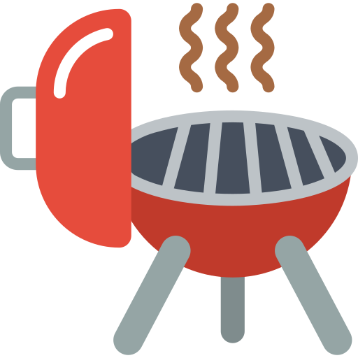

# Churras Calculator - Calculadora de Churrasco

## Visão Geral

O Churras Calculator é uma simples aplicação web desenvolvida com HTML5, CSS3 e JavaScript que ajuda você a calcular a quantidade de carne, cerveja e bebidas necessárias para um churrasco com base no número de adultos, crianças e na duração do evento.

## Funcionalidades

- Campos de entrada para o número de adultos, crianças e a duração do churrasco.
- Botão "Calcular" para realizar o cálculo.
- Exibição das quantidades recomendadas de carne, cerveja e bebidas.
- Design responsivo para diferentes tamanhos de tela.

## Utilização

1. Abra o arquivo `index.html` em seu navegador da web.
2. Preencha as seguintes informações:
   - Número de adultos presentes no churrasco.
   - Número de crianças presentes no churrasco.
   - Duração esperada do churrasco em horas.
3. Clique no botão "Calcular" para realizar os cálculos.
4. Os resultados serão exibidos abaixo dos campos de entrada, mostrando as quantidades recomendadas de carne (em quilogramas), cerveja (em latas de 350ml) e bebidas (em garrafas de 2 litros ou equivalentes).

## Lógica de Cálculo

A aplicação utiliza as seguintes regras para calcular as quantidades:

- **Carne:** 500g por pessoa para eventos com duração inferior a 6 horas ou 750g por pessoa para eventos com duração de 6 horas ou mais. Crianças contam como meia pessoa.

- **Cerveja:** 2,2 litros (aproximadamente 3 latas de 350ml) por adulto para eventos com duração inferior a 6 horas ou 3 litros por adulto para eventos com duração de 6 horas ou mais.

- **Bebidas (Refrigerante/Suco):** 1 litro por pessoa para eventos com duração inferior a 6 horas ou 1,5 litros por pessoa para eventos com duração de 6 horas ou mais. Crianças contam como meia pessoa.

## Personalização

Você pode personalizar a aparência e o comportamento da aplicação modificando os arquivos CSS e JavaScript (`style.css` e `script.js`).

## Contribuições

Contribuições para melhorar esta calculadora são bem-vindas. Sinta-se à vontade para fazer um fork do repositório e enviar pull requests.

## Licença

Este projeto está licenciado sob a [Licença MIT](LICENSE). Você está livre para usar e modificar o código para seus próprios fins.

---

Aproveite o seu churrasco e feliz cálculo! 🍖🍻🥤
